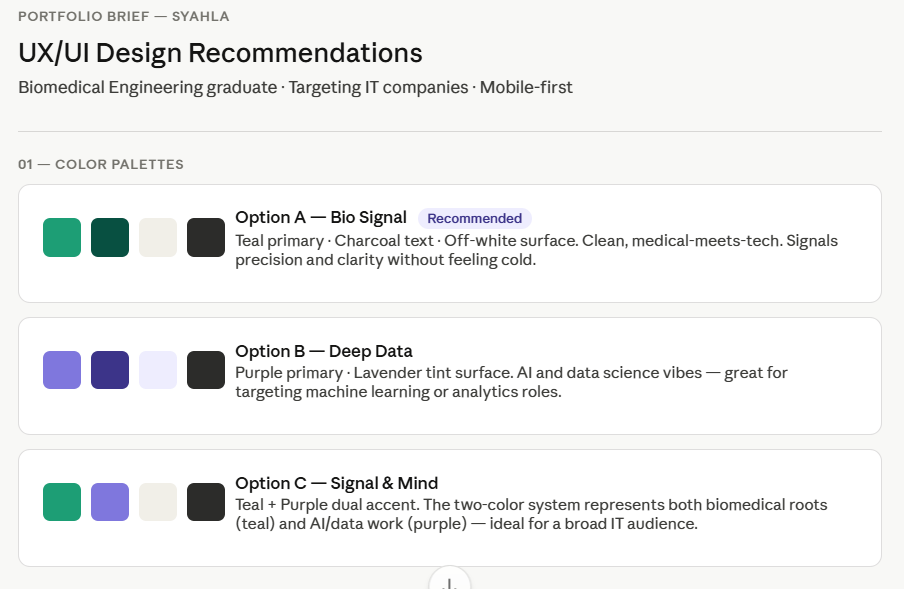
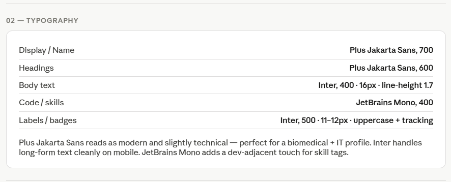
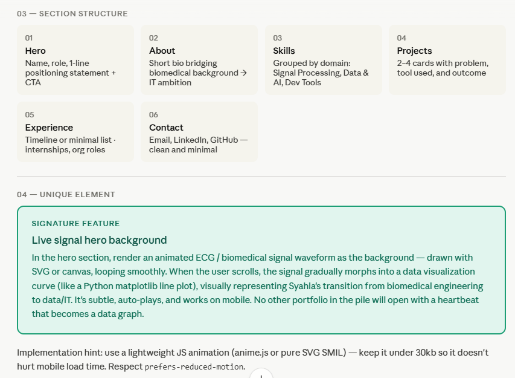

# Brainstorm — Syahla Maharani Salsabila

## Prompt 1
Role: UX/UI consultant for a portfolio developer.
Task: Help brainstorm portfolio designs for a recent Biomedical Engineering graduate.

Context:
- Name: Syahla
- Skills: MATLAB (biomedical signal processing, image/video analysis), Python, C, Microsoft Excel, Microsoft Word, Google Workspaces, Power BI, Artificial Intelligence, Prompt Engineering, Data Analysis, Data Visualization
- Target: IT Company

Constraints:
- Mobile-first
- Simple yet stand out

Output:
1. 3 color palette options
2. Typography recommendation
3. Section structure
4. 1 unique element

## AI Response 1
Here's a full UX/UI brief for Syahla's portfolio — built for a biomedical engineering grad targeting IT companies, with a mobile-first, "smart but approachable" vibe.

Here's a quick rationale for the key decisions:

**Why these palettes?** Teal reads as both medical (clean, precise) and tech (modern SaaS tools use it widely). Purple leans into AI/data science — which is where Syahla's MATLAB signal processing and Python skills land. Option C combining both tells a coherent "bridging two worlds" story, which is exactly the narrative an IT recruiter needs to understand quickly.

**Why Plus Jakarta Sans?** It's geometric and confident without feeling cold — it differentiates from the generic Inter-only portfolios that flood the junior dev pool. Using JetBrains Mono for skill tags subtly signals technical literacy without overplaying it.

**Why the signal-to-data animation?** Syahla's biggest challenge is convincing an IT company to hire a biomedical engineer. The hero animation does the storytelling work before a recruiter reads a single word — the heartbeat literally becomes a data graph, making the career pivot feel intentional and elegant rather than "different field."

**Section structure note:** Keep the Skills section grouped by domain (not alphabetical) — grouping by "Signal Processing / Data & AI / Dev Tools" makes it scannable for a technical recruiter in 5 seconds on mobile.

Want me to mock up the hero section layout, or generate a sample color-applied component like a project card?

## Prompt 2 
Is a single-page layout better, or a multi-page layout?

## AI Response 2
Short answer: single-page is the better default for you — but with a hybrid feel so it doesn’t get boring or heavy.

Here’s the honest breakdown based on your goal (fresh grad → IT company, mobile-first):

🚫 Pure multi-page (less ideal for you)

Multi-page portfolios are great when:
You have a lot of projects (5–10+),
Each project needs deep case studies,
You already have strong credibility,

But in your case:

Recruiters will spend ~5–10 seconds scanning,
Extra clicks = higher chance they bounce,
Your strength is clear storytelling, not volume,

👉 So multi-page can feel too “heavy” for a junior profile.

✅ Single-page (best fit for you)

Your current structure actually already supports this perfectly:
Hero,
About,
Skills,
Projects,
Experience,
Contact

That’s exactly how a high-converting portfolio should flow.

Why this works especially well:
📱 Mobile-first scrolling = natural behavior
⚡ Recruiters get your story instantly
💡 Your ECG → data animation hits immediately (this is a big advantage)
🔥 The smarter approach: “Single-page with depth”

Don’t think strictly single vs multi. Do this instead:

👉 Keep:
One main scrolling page
👉 Add:
Expandable project sections OR modal
Click → opens deeper explanation
No page reload

OR

Optional “View Case Study” page (only for 1–2 strongest projects)
💡 My recommendation for YOU specifically
Given your concept (biomedical → data/AI storytelling):

👉 Go with:
Single-page + interactive project expansion

Why:
Keeps it clean and modern,
Supports your animation-driven hero,
Feels more like a product experience (which recruiters love),

⚖️ Quick decision table
Option	Verdict	Why
Single-page	✅ Best	Fast, clean, recruiter-friendly
Multi-page	❌ Not ideal	Too heavy for junior portfolio
Hybrid (recommended)	⭐ Perfect	Clean + still shows depth
One important pushback (so you don’t make a common mistake)

A lot of people think:
“More pages = more professional”

That’s outdated.

In 2025 hiring reality:
Clarity + speed beats completeness

## Prompt 3
Are there any other ideas for the font to use?

## AI Response 3
Short answer: yes—but be careful. Your current combo (Plus Jakarta Sans + Inter + JetBrains Mono) is already very solid. Changing fonts won’t magically improve your portfolio unless it strengthens your “biomedical → data/AI” narrative.

So instead of random alternatives, here are smart font directions that actually shift your vibe intentionally:

🧠 1. “Technical but human” (strong alternative)

If you want something slightly more distinctive than Inter:

Headings: Sora or Manrope

Body: Manrope or Inter

Code: JetBrains Mono (keep this)

Why:
Feels more modern + product-oriented,
Still clean, but less “default portfolio template”

👉 Best if you want to look like a startup/product engineer

🧬 2. “Medical precision meets research”

Lean into your biomedical identity:

Headings: IBM Plex Sans

Body: IBM Plex Sans or IBM Plex Serif

Code: IBM Plex Mono

Why:
Designed for technical + scientific contexts,
Feels like research + engineering, not just UI design

👉 Great if you want to stand out as “not just another IT grad”

📊 3. “Data/AI aesthetic”

More analytical, slightly sharper:

Headings: Space Grotesk

Body: Inter

Code: JetBrains Mono

Why:
Space Grotesk gives a data/AI lab vibe,
Adds personality without hurting readability

👉 Matches your purple / AI direction

⚡ 4. “Minimal but premium”
If you want ultra-clean, recruiter-safe but still polished:

Headings: General Sans

Body: Inter

Code: JetBrains Mono

Why:
Feels like modern SaaS / tech companies,
Very readable on mobile

🎛️ 5. Smart combo tied to your concept (my favorite for you)

Since your idea is dual identity (bio + data):

Headings: Plus Jakarta Sans (keep)

Body: Inter (keep)

Code/skills: JetBrains Mono (keep)

👉 BUT:
Use typography as a system, not just fonts:

Biomedical sections → slightly softer spacing

Data sections → tighter, more structured spacing

Mono font only for:

Skills

Tools

Small labels

Why this works better than changing fonts:
You create contrast through usage, not just font choice.

🚫 Honest advice (important)

Don’t over-optimize fonts.
Most junior portfolios fail because of:

❌ Poor hierarchy
❌ Inconsistent spacing
❌ Weak project storytelling

Not because:
“the font wasn’t unique enough”

🎯 My recommendation for YOU

Stick with your current:

Plus Jakarta Sans + Inter + JetBrains Mono

…and upgrade it by:

Better hierarchy (size, weight)

Clear section rhythm

Strategic mono usage

👉 That will look more “pro” than switching to trendy fonts.

## Prompt 4
How is this different from other candidates?

## AI Response 4
Right now, your concept is good—but let’s be honest: parts of it are still similar to many junior portfolios. The difference only becomes real if you execute the idea with intention.

Here’s the clear breakdown:

🚫 What most candidates do

Typical junior IT portfolio:
Clean layout (Hero, About, Projects, Contact)
Uses Inter / similar fonts
Static project cards

Generic claims like:
“Passionate about technology and problem-solving”

👉 Result: looks nice, but forgettable

✅ Where YOU are already different
1. You have a clear narrative (rare)

Most people:
“I studied X, now I want to work in tech”

You:
Biomedical signal → Data/AI transformation
That’s a story, not just a background.

👉 This is your biggest advantage.

2. Your hero isn’t decorative—it’s explanatory

That ECG → data animation?

It’s not just visual. It communicates:
You understand signals
You can translate them into data insights
You’re intentionally transitioning fields

Most candidates:
Put a random illustration or gradient

You:
Show your thinking in 2 seconds

3. You’re positioning yourself as a bridge

Companies don’t just hire “skills”—they hire perspective.

You bring:
Biomedical understanding (rare in IT pool)
Signal processing mindset
Data/AI direction

👉 That combination is uncommon.

⚠️ Where you’re STILL similar (important reality check)

If you stop at:
Nice UI
Standard sections
Basic project descriptions

Then you become:
“Slightly more aesthetic version of everyone else”

That’s not enough.

🔥 What will ACTUALLY make you stand out
1. Show thinking, not just results

Most candidates show:
Final output
Tools used

You should show:
Why this approach
How you processed data
What trade-offs you made

👉 This is where you separate from 90% of juniors.

2. Make interaction meaningful

Not just:
Hover effects
Animations

But:
Signal → insight slider
Mini demos of processing
Data transformation visuals

👉 Interaction = proof of skill

3. Be specific, not generic

Avoid:
“Built a machine learning model”

Say:
“Processed noisy EMG signals → extracted features → classified patterns using X method → improved accuracy by Y%”

👉 Specificity = credibility

4. Own your “non-traditional” background

Don’t hide biomedical.

Turn it into:
“I approach data problems like signal systems”

That’s your edge.

🧠 The real difference (in one sentence)

Other candidates:
“I can use tools”

You:
“I understand how data behaves and how to transform it into insight”

🎯 Final honest verdict

Right now:
Your direction = above average
Your potential = top 10%

But:
Your execution will decide everything

## Key Decisions
| Decision | Value | Why |
|----------|-------|-----|
| Color | Option C — Signal & Mind (Teal + Purple) | Combines biomedical identity (teal) with data/AI direction (purple), clearly positioning myself as a bridge between two fields. More distinctive than single-theme palettes and supports the narrative visually. |
| Typography | Plus Jakarta Sans + Inter + JetBrains Mono | Clean, modern, and highly readable for mobile. Jakarta Sans adds personality, Inter ensures clarity for body text, and JetBrains Mono subtly reinforces technical credibility in skills/labels. Strong without being overdesigned. |
| Layout | Single-page (mobile-first) with interactive depth | Optimized for recruiter behavior—fast scrolling, quick understanding, minimal friction. Interactive elements (e.g., expandable projects or sliders) add depth without sacrificing speed or simplicity. |
| Style | Signal-to-data storytelling with meaningful interaction | Uses animation and interaction (e.g., ECG → data, signal transformation) to communicate my thinking. Creates a memorable, concept-driven experience that different from generic portfolios. |